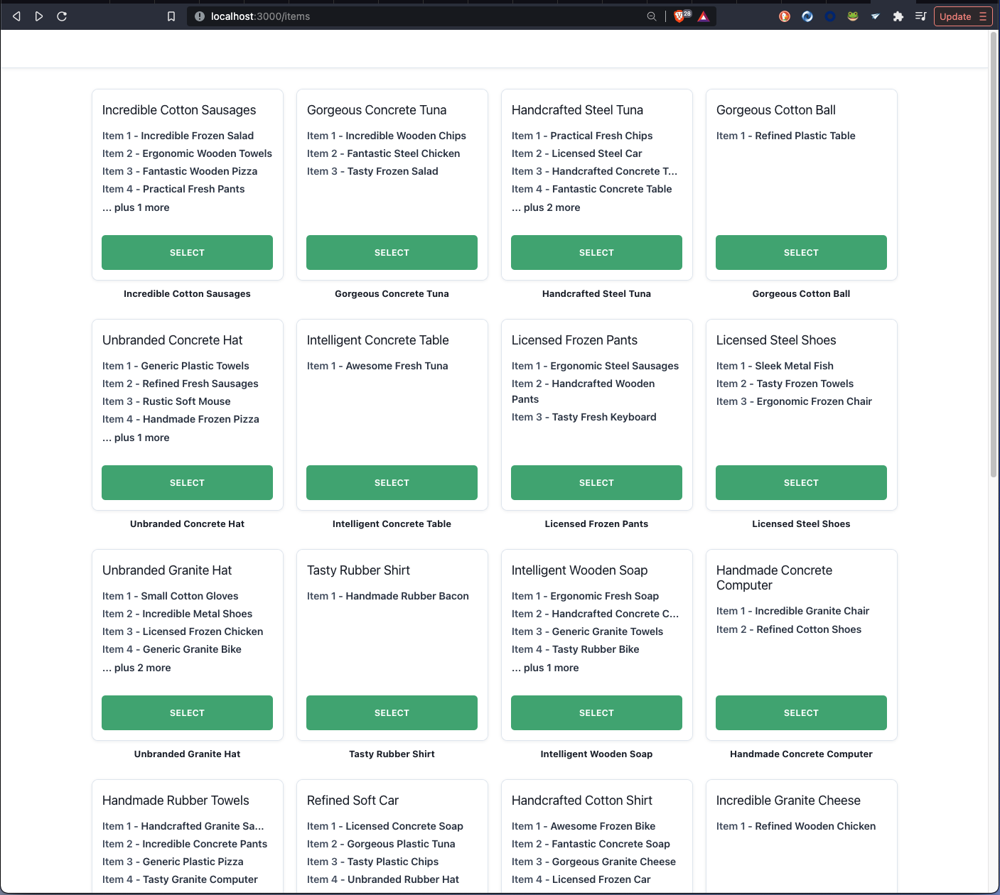
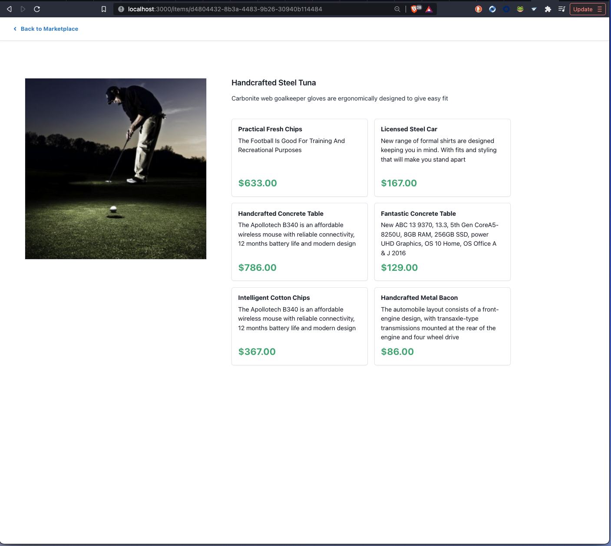

### Intro

This exercise is to test your understanding of JavaScript/TypeScript and the React framework in a real world setting. The goal is to create a mock-up of a generic marketplace page using an API that is similar in structure to the api we use at Postal.

There are two tiers to this project:

### Tier One - The M.V.P.

For this part, you will create two pages: One page that shows a list of "Items", and a details page for a given Item.

To get started, query the API (end-points listed below) for an array of objects that contain the data for each Item. Create a reusable card component that will take the item data as a prop and display the necessary Item information, including a list of variant names. If there are more than 4 variants, show a message to the user that there are more variants than what is listed. You can then iterate over this data and use your new component to show a summary of each item within a Grid. This card should also include a button that will allow the user to select the item.

Selecting an item should navigate the user to a new page that shows more information for the item, including the item's image as well as a full list of variants (hint: since there is a varying amount of variants, another reusable component would be handy here).

You will notice that the url changes based on the ID of a given Item. A user should be able to take that URL and get back to the same detail view. Setting up a simple React Router will be useful here.

The last piece is to include a "back button" that will take the user back to the main marketplace page.

Both pages should be responsive.

 [](assets/tierOne-items.png)

 [](assets/tierOne-detail.png)

 [](assets/itemPage.gif)

 [](assets/detailPage.gif)

 [](assets/navigation.gif)

### Tier Two - Adding a hover effect to the Item cards (Reach goal - optional)

Only move onto this step if you have already completed Tier One and you are looking for an additional challenge.

Modify your card component to include the image of your item as the main display. When a user hovers over the item, show the same data for the item that is described above. If you want, you can still show the image in the background.

For this step, it will be necessary to create another component that can effectively be toggled "on/off" when a user hovers over it. There will also be a good amount of CSS involved, especially related to "fixed" and "relative" positioning.

The rest of the app should function the same way as described above.

 [](assets/hoverView.gif)

### Notes

You are NOT required to use any specific CSS library. At Postal, however, we primarily utilize the chakra-ui library for our front-end components. Other than the functional requirements above, you are free to style your application in any way that you choose.

The file structure provided in this project is just a basic set-up. You are free to change or add files/packages as you need.

You are free to use any method you choose to connect to the API. The structure of the Item object returned by the API is shown below:

```
{
    id: string,
    name: string,
    description: string,
    variants: [
      id: string,
      name: string,
      description: string,
      price: number,
    ],
    imageUrls: [
      {
        url: string,
      },
    ],
  };
```

### Setup

```
yarn install
```

### Run Application

```
yarn start
```

Running `yarn start` will start the application on port 3000 and the API on port 3001.

### API endpoints

There are only two end-points needed:

#### GET /items

Get the list of items available

```
http://localhost:3001/items
```

#### GET /items/:id

Get the details of a specific item by adding the id to the path.

```
http://localhost:3001/items/:id
```
